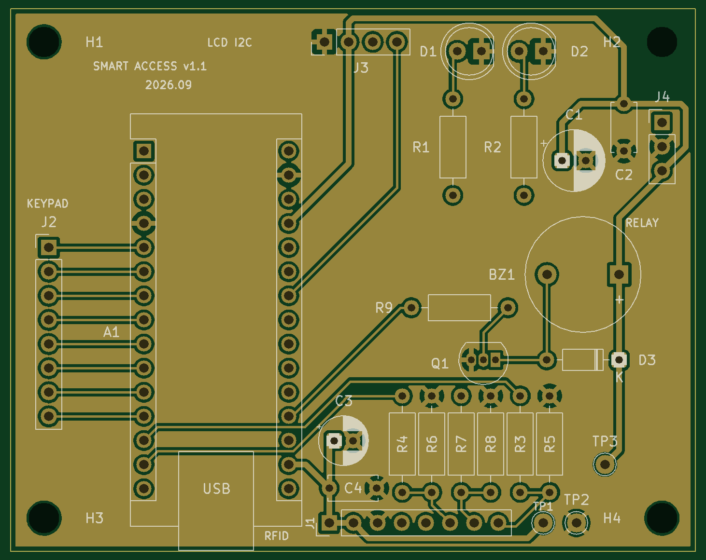

# Smart Access Control — RFID + PIN Door Lock

Two-factor access control terminal on a custom PCB. Verification combines
something you **have** (a 13.56 MHz contactless card) with something you
**know** (a 4-digit PIN), driving an electric strike through a relay.




*PCB v1.1 rendered from the fabrication Gerbers. A photo of the assembled board replaces it after bring-up.*

---

## Status

| Stage | State |
|---|---|
| Firmware | Working on a breadboard |
| Schematic v1.1 | Complete, ERC clean |
| PCB v1.1 | 2-layer, 72 × 57 mm, all 28 nets routed, DRC clean |
| Fabrication | **v1.1 ordered 29 Sep 2026** (JLCPCB, 5 pcs) — files in [`fab/v1.1`](Zamek_RFID_Hardware/fab/v1.1) |
| Assembly and bring-up | Pending — boards expected mid-October |

v1.0 was never manufactured: a design review found blocking errors first.
[What the review caught](#what-the-v10-review-caught--fixed-in-v11) is the part
of this repository I would point a reviewer to first.

---

## Why this project

I wanted one device that forced me through the full hardware workflow rather
than a breadboard demo: requirements, schematic capture, footprint assignment,
layout, design rule check, manufacturing output, assembly, and bring-up.
Access control was chosen because its failure modes are interesting — a lock
that fails open is a security problem, and a lock that fails closed is a
safety problem.

---

## How it works

```
        ┌──────────────┐  SPI   ┌─────────────┐
        │  MFRC522     │◄──────►│             │
        │  RFID reader │        │             │
        └──────────────┘        │             │
                                │  ATmega328P │  GPIO   ┌────────────┐  12 V
        ┌──────────────┐  GPIO  │  (Nano)     │────────►│   Relay    │───────►
        │  4×4 keypad  │◄──────►│             │         │            │  strike
        └──────────────┘        │             │         └────────────┘
                                │             │
        ┌──────────────┐  I2C   │             │  GPIO   ┌────────────┐
        │  LCD 16×2    │◄──────►│             │────────►│ LEDs, buzz │
        └──────────────┘        └─────────────┘         └────────────┘
```

The firmware is a finite state machine with five states:

```
WAIT_FOR_CARD ──card matches──► WAIT_FOR_PIN ──► ENTERING_PIN
      ▲                                                │
      │                                    ┌───────────┴───────────┐
      │                                    ▼                       ▼
      └────────────────────────────── GRANTED                  DENIED
```

Access requires **both** factors. A valid card alone does not unlock the door.

---

## Hardware

### Pin map

| Function | Signal | Pin | Notes |
|---|---|---|---|
| RFID | SDA / SS | D10 | SPI chip select |
| RFID | MOSI | D11 | |
| RFID | MISO | D12 | |
| RFID | SCK | D13 | |
| LCD | SDA | A4 | I²C, address 0x27 |
| LCD | SCL | A5 | |
| Keypad | Rows R1–R4 | D6–D9 | |
| Keypad | Cols C1–C4 | D5–D2 | |
| Buzzer | — | A0 | |
| LED green | — | A1 | |
| LED red | — | A2 | |
| Relay | — | A3 | **Active LOW** |

### Design decisions

**Relay driven active LOW, initialised HIGH before `pinMode()`.**
During early testing the strike pulsed briefly at power-up. The relay module
is active LOW, so the pin's default state after reset released the lock for a
few milliseconds. Writing HIGH *before* configuring the pin as an output
removes the glitch. A lock that opens on every power cycle is not a lock.

**RFID reader on a connector, not on the board.**
The MFRC522 carries a tuned 13.56 MHz antenna. Putting an untuned antenna on
my own two-layer board would have meant an RF design problem I was not ready
to solve, so the module plugs into a header on a cable. That is also how a
door installation needs it: the reader outside, the controller inside.

**GND pour on both layers and a 0.6 mm power net class** to shorten return
paths for the SPI bus and give the relay switching current somewhere
low-impedance to go. Signals stay at 0.25 mm.

**The relay module switches the strike, not this board.** The strike's supply
goes to the module's own screw terminals; the board only drives its IN line.

---

## Security analysis

Honest assessment of this design. None of these are hypothetical.

| Weakness | Impact | Planned mitigation (firmware) |
|---|---|---|
| Authentication uses only the card **UID** | MIFARE Classic UIDs are readable by any phone with NFC and writable on cheap magic cards, so the card factor can be cloned in under a minute | Move to MIFARE DESFire EV3 with AES challenge–response, where the key never crosses the air interface |
| No lockout on failed PIN attempts | 4 digits is 10 000 combinations against a fixed 2 s penalty — roughly 5.5 hours of unattended guessing | Lock out after 5 attempts with exponential backoff, persisted to EEPROM so a power cycle does not reset it |
| No session timeout after a valid card | Present a card, walk away, and the terminal waits indefinitely for a PIN from anyone | 15 s timeout back to idle |
| PIN stored in plaintext in firmware | Anyone who dumps flash over ICSP reads the PIN | Store a salted hash in EEPROM; compare in constant time |
| Credentials are compile-time constants | Adding a user means reflashing | Master-card enrolment, users in EEPROM |
| MCU flash is readable | Full firmware and secrets extractable | Set the AVR lock bits |

**Not addressed by this design:** an attacker with physical access to the
*secure side* can simply bridge the relay contacts. Like most commercial
terminals, this device assumes the controller and wiring are on the protected
side of the door. Real installations put the decision logic inside and only
the reader outside — which is exactly what the OSDP protocol exists for, and
where v2 is headed.

---

## What the v1.0 review caught — fixed in v1.1

| Problem in v1.0 | Consequence | Fix in v1.1 |
|---|---|---|
| Both status LEDs wired in reverse — the MCU pin drove the cathode, the anode sat at GND | The LEDs could never light, whatever the firmware did | Polarity corrected and verified pad by pad in the board file |
| No decoupling capacitors at all | A supply dip when the relay switched, which I had masked in firmware | 100 nF + 100 µF on 5 V, 100 nF + 10 µF at the reader |
| 5 V SPI into the 3.3 V MFRC522, whose inputs are rated to VDD + 0.5 V | Inputs out of specification | 1 kΩ / 2 kΩ dividers on SS, MOSI and SCK (3.33 V); MISO direct |
| Buzzer driven straight from a GPIO | Close to the ATmega328P per-pin limit, inductive kick unclamped | BC547 driver with a 1N4148 flyback diode |
| Every net at 0.25 mm, +5 V and GND included | No margin on the power paths | `Power` net class at 0.6 mm, GND pour on both layers |
| No mounting holes | The board could not be fixed in an enclosure | 4 × M3 |
| No test points, connectors unlabelled | Hard to measure and easy to wire wrong | Test points on 3V3, 5V and GND; every connector pin labelled on the silkscreen |

## Open items

**Hardware**
- Keypad connector J2 is wired C4 C3 C2 C1 R1 R2 R3 R4, while a typical membrane
  ribbon runs R1 R2 R3 R4 C1 C2 C3 C4. To be checked on the real keypad; the fix
  belongs in `keys[][]`, not on the board.
- The reader's RST pin is tied to 3.3 V, so the MCU cannot hard-reset a hung
  reader — software reset only.

**Firmware** — unchanged since v1.0, next milestone after bring-up
- `String` on a 2 kB RAM part risks heap fragmentation — replace with a fixed
  `char` buffer.
- `delay()` inside the state machine blocks the keypad and reader for up to
  3 seconds — replace with `millis()` timing.
- No timeout after a valid card and no lockout after failed PINs (see the
  security analysis).
- No check that the reader is present at boot; an unplugged module fails
  silently.
- Successful UIDs are printed to the serial port.

---

## Repository layout

```
├── src/main.cpp                       firmware (PlatformIO, Arduino framework)
├── include/config.example.h           copy to config.h — config.h is gitignored
├── Zamek_RFID_Hardware/
│   ├── Zamek_RFID_Hardware/           KiCad 10 project: schematic and PCB
│   └── fab/v1.1/                      Gerbers, drill files and BOM sent to the fab
└── docs/
    ├── lab-notebook.md                what I did, measured and learned — failures included
    ├── zakupy_v1.1.md                 parts list for assembling v1.1
    └── img/                           renders now, photos after bring-up
```

## Build

```bash
cp include/config.example.h include/config.h   
pio run --target upload
```

Requires [PlatformIO](https://platformio.org/). Target: `nanoatmega328new`.
